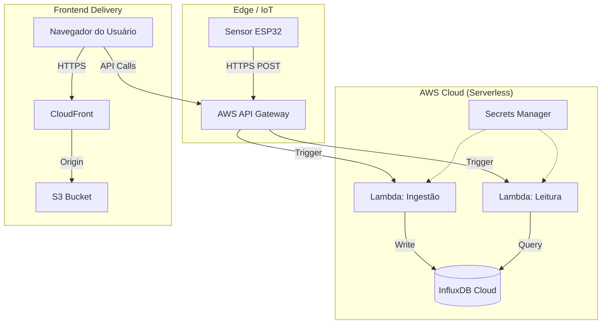

# WireSense

> **Monitoramento de Energia Inteligente em Tempo Real**

O **WireSense** é um sistema de monitoramento de energia desenvolvido como uma solução IoT completa (End-to-End). Seu objetivo é coletar, processar e exibir dados elétricos com alta precisão, fornecendo uma visão consolidada do consumo energético em tempo real e análises históricas.

O projeto integra hardware de ponta, arquitetura serverless em nuvem e uma interface moderna, demonstrando o ciclo completo do dado: do sensor físico até a tela do usuário.

---

## 📘 Visão Geral do Sistema

O fluxo de funcionamento do WireSense segue 5 etapas críticas:

1.  **Coleta (IoT)** — Um dispositivo baseado em ESP32, equipado com sensores de corrente não-invasivos, mede o consumo elétrico milhares de vezes por segundo e transmite os dados via HTTPS.
2.  **Ingestão Serverless** — O **AWS API Gateway** recebe os dados e aciona funções **AWS Lambda**, que validam e processam a carga.
3.  **Armazenamento Temporal** — Os dados são gravados no **InfluxDB**, um banco de dados otimizado para séries temporais (Time Series), ideal para telemetria de alta frequência.
4.  **Backend de Leitura** — Funções Lambda separadas consultam o banco para entregar agregações (média, soma, picos) para o frontend.
5.  **Visualização (Frontend 2.0)** — Uma aplicação **React** moderna consome esses dados para gerar dashboards interativos e relatórios financeiros.

---

## ☁️ Arquitetura e Tecnologias

O WireSense utiliza uma stack moderna e distribuída para garantir escalabilidade, segurança e baixo custo de operação.

### Infraestrutura na AWS (IaC)
Toda a infraestrutura é provisionada via **Terraform**, garantindo que o ambiente seja reprodutível e auditável:

*   **S3**: Hospedagem estática segura dos arquivos do frontend.
*   **CloudFront**: CDN global que distribui a aplicação com baixa latência e SSL/TLS.
*   **API Gateway**: Porta de entrada escalável para os dados dos sensores e requisições do usuário.
*   **AWS Lambda**: Computação serverless para regras de negócio, ingestão de dados e consultas, eliminando a necessidade de servidores ligados 24/7.
*   **DynamoDB**: Utilizado para controle de estado (*state locking*) do Terraform, prevenindo conflitos de deploy.
*   **CloudWatch**: Centralização de logs e métricas de saúde das funções e da API.
*   **Secrets Manager**: Gerenciamento seguro de credenciais (chaves de API, senhas do banco) sem expô-las no código.

### Banco de Dados
*   **InfluxDB**: Escolhido especificamente para IoT. Permite consultas ultra-rápidas de faixas de tempo (ex: "últimos 30 dias") e downsampling automático de dados antigos.

### Frontend (v2.0)
A interface foi reconstruída com foco em performance e usabilidade:
*   **Stack**: React 18, Vite, TailwindCSS.
*   **Estado e Store**: Context API para gerenciamento global (Sessão, Dispositivos, Configurações).
*   **Persistência Local**: Estratégia *Local-First* inteligente, salvando preferências do usuário no navegador.

---

## 🧠 Estrutura Lógica

O diagrama abaixo ilustra o fluxo detalhado da informação através dos componentes da arquitetura:



---

## ✨ Funcionalidades da Interface

A nova versão da interface web traz recursos avançados para análise e gestão:

### 1. Dashboard em Tempo Real
*   **Telemetria Instantânea**: Visualização de Potência (Watts) e Corrente (Amperes) com atualização a cada 5 segundos.
*   **Temas Contextuais**: O design se adapta automaticamente:
    *   *Tema Emerald/Gold* para **Geração Solar**.
    *   *Tema Cyan/Violet* para **Consumo Residencial**.
*   **Saúde do Sistema**: Indicadores visuais de status da conexão e alertas de anomalia.

### 2. Histórico Granular
Ferramentas de análise para diferentes janelas temporais, permitindo identificar padrões de consumo:
*   **Visão Diária**: Controles para **7 Dias** ou **30 Dias**.
*   **Visão Mensal**: Análise macro de **6 Meses** ou **1 Ano**.
*   **Gráficos Interativos**: Zoom, tooltips e exportação de dados.

### 3. Gestão Financeira e Relatórios
*   **Multimoeda**: Suporte nativo para conversão instantânea entre **Real (R$)**, **Dólar ($)** e **Euro (€)**.
*   **Previsão de Custos**: Projeção de gastos baseada na tarifa configurada.
*   **Metas de Orçamento**: Defina um teto de gastos mensal e acompanhe o progresso em tempo real.

### 4. Gestão de Dispositivos e Perfil
*   **Configurações Isoladas**: Cada dispositivo (ex: Ar Condicionado, Inversor) mantém suas próprias configurações de voltagem (110v/220v) e tarifa.
*   **Segurança**: Login robusto via Google, com proteção de rotas e persistência de sessão.

---

## 🚀 Instalação e Execução (Frontend)

Para rodar a interface localmente:

1.  **Clone o repositório**
    ```bash
    git clone https://github.com/seu-usuario/wiresense.git
    cd wiresense/frontend
    ```

2.  **Instale as dependências**
    ```bash
    npm install
    ```

3.  **Execute o servidor de desenvolvimento**
    ```bash
    npm run dev
    ```
    O sistema estará acessível em `http://localhost:5173`.
    > **Nota**: Caso a API real não esteja configurada localmente, o frontend utilizará automaticamente o **Mock Service** integrado para demonstração.

---

## 👥 Autores

*   **Matheus Poles Nunes**
*   **Marciel Soares Silva**
